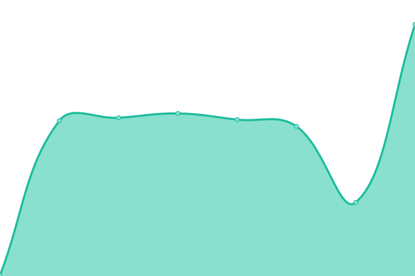

# [📈 Live Status](https://dbethke.github.io/upptime): <!--live status--> **🟧 Partial outage**

<!--start: status pages-->
<!-- This summary is generated by Upptime (https://github.com/upptime/upptime) -->
<!-- Do not edit this manually, your changes will be overwritten -->
<!-- prettier-ignore -->
| URL | Status | History | Response Time | Uptime |
| --- | ------ | ------- | ------------- | ------ |
|  [Google](https://www.google.com) | 🟩 Up | [google.yml](https://github.com/dbethke/upptime-catalina/commits/HEAD/history/google.yml) | 

 101ms
     
 | 

<a href="https://dbethke.github.io/upptime/history/google">100.00%</a>
    

|  [Twitter](https://www.twitter.com) | 🟩 Up | [twitter.yml](https://github.com/dbethke/upptime-catalina/commits/HEAD/history/twitter.yml) | 

 497ms
     
 | 

<a href="https://dbethke.github.io/upptime/history/twitter">100.00%</a>
    

|  [SWTOR](https://www.swtor.com) | 🟩 Up | [swtor.yml](https://github.com/dbethke/upptime-catalina/commits/HEAD/history/swtor.yml) | 

 219ms
     
 | 

<a href="https://dbethke.github.io/upptime/history/swtor">100.00%</a>
    

|  [EA](https://www.ea.com) | 🟩 Up | [ea.yml](https://github.com/dbethke/upptime-catalina/commits/HEAD/history/ea.yml) | 

 220ms
     
 | 

<a href="https://dbethke.github.io/upptime/history/ea">100.00%</a>
    

|  servzilla | 🟥 Down | [servzilla.yml](https://github.com/dbethke/upptime-catalina/commits/HEAD/history/servzilla.yml) | 

 0ms
     
 | 

<a href="https://dbethke.github.io/upptime/history/servzilla">0.00%</a>
    

|  pi02 | 🟥 Down | [pi02.yml](https://github.com/dbethke/upptime-catalina/commits/HEAD/history/pi02.yml) | 

 0ms
     
 | 

<a href="https://dbethke.github.io/upptime/history/pi02">100.00%</a>
    

|  sonarr | 🟩 Up | [sonarr.yml](https://github.com/dbethke/upptime-catalina/commits/HEAD/history/sonarr.yml) | 

 259ms
     
 | 

<a href="https://dbethke.github.io/upptime/history/sonarr">0.00%</a>
    

|  radarr | 🟩 Up | [radarr.yml](https://github.com/dbethke/upptime-catalina/commits/HEAD/history/radarr.yml) | 

 238ms
     
 | 

<a href="https://dbethke.github.io/upptime/history/radarr">0.00%</a>
    

|  nzbget | 🟥 Down | [nzbget.yml](https://github.com/dbethke/upptime-catalina/commits/HEAD/history/nzbget.yml) | 

 228ms
     
 | 

<a href="https://dbethke.github.io/upptime/history/nzbget">100.00%</a>
    

<!--end: status pages-->

[**status website →**](https://dbethke.github.io/upptime)

## 📄 License

- Powered by: [Upptime](https://github.com/upptime/upptime)
- Code: [MIT](./LICENSE) © [Daniel Bethke](https://dbethke.github.io/upptime)
- Data in the `./history` directory: [Open Database License](https://opendatacommons.org/licenses/odbl/1-0/)
