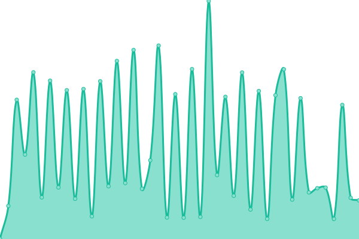

# [📈 Live Status](https://dbethke.github.io/upptime): <!--live status--> **🟧 Partial outage**

This repository contains the open-source uptime monitor and status page for [Daniel Bethke](https://dbethke.github.io/upptime), powered by [Upptime](https://github.com/upptime/upptime).

With [Upptime](https://upptime.js.org), you can get your own unlimited and free uptime monitor and status page, powered entirely by a GitHub repository. We use [Issues](https://github.com/dbethke/upptime/issues) as incident reports, [Actions](https://github.com/dbethke/upptime/actions) as uptime monitors, and [Pages](https://dbethke.github.io/upptime) for the status page.

<!--start: status pages-->
<!-- This summary is generated by Upptime (https://github.com/upptime/upptime) -->
<!-- Do not edit this manually, your changes will be overwritten -->
<!-- prettier-ignore -->
| URL | Status | History | Response Time | Uptime |
| --- | ------ | ------- | ------------- | ------ |
|  [Google](https://www.google.com) | 🟩 Up | [google.yml](https://github.com/dbethke/upptime/commits/HEAD/history/google.yml) | 

 67ms
     
 | 

<a href="https://dbethke.github.io/upptime/history/google">100.00%</a>
    

|  [Twitter](https://www.twitter.com) | 🟩 Up | [twitter.yml](https://github.com/dbethke/upptime/commits/HEAD/history/twitter.yml) | 

 349ms
     
 | 

<a href="https://dbethke.github.io/upptime/history/twitter">98.13%</a>
    

|  [Twitch](https://www.twitch.com) | 🟩 Up | [twitch.yml](https://github.com/dbethke/upptime/commits/HEAD/history/twitch.yml) | 

 521ms
     
 | 

<a href="https://dbethke.github.io/upptime/history/twitch">100.00%</a>
    

|  [SWTOR](https://www.swtor.com) | 🟩 Up | [swtor.yml](https://github.com/dbethke/upptime/commits/HEAD/history/swtor.yml) | 

 226ms
     
 | 

<a href="https://dbethke.github.io/upptime/history/swtor">100.00%</a>
    

|  [EA](https://www.ea.com) | 🟩 Up | [ea.yml](https://github.com/dbethke/upptime/commits/HEAD/history/ea.yml) | 

 259ms
     
 | 

<a href="https://dbethke.github.io/upptime/history/ea">100.00%</a>
    

|  servzilla | 🟩 Up | [servzilla.yml](https://github.com/dbethke/upptime/commits/HEAD/history/servzilla.yml) | 

 386ms
     
 | 

<a href="https://dbethke.github.io/upptime/history/servzilla">82.13%</a>
    

|  sonarr | 🟩 Up | [sonarr.yml](https://github.com/dbethke/upptime/commits/HEAD/history/sonarr.yml) | 

 1079ms
     
 | 

<a href="https://dbethke.github.io/upptime/history/sonarr">82.13%</a>
    

|  radarr | 🟩 Up | [radarr.yml](https://github.com/dbethke/upptime/commits/HEAD/history/radarr.yml) | 

 909ms
     
 | 

<a href="https://dbethke.github.io/upptime/history/radarr">82.13%</a>
    

|  nzbget | 🟥 Down | [nzbget.yml](https://github.com/dbethke/upptime/commits/HEAD/history/nzbget.yml) | 

 326ms
     
 | 

<a href="https://dbethke.github.io/upptime/history/nzbget">100.00%</a>
    

<!--end: status pages-->

[**Visit our status website →**](https://dbethke.github.io/upptime)

## 📄 License

- Powered by: [Upptime](https://github.com/upptime/upptime)
- Code: [MIT](./LICENSE) © [Daniel Bethke](https://dbethke.github.io/upptime)
- Data in the `./history` directory: [Open Database License](https://opendatacommons.org/licenses/odbl/1-0/)
